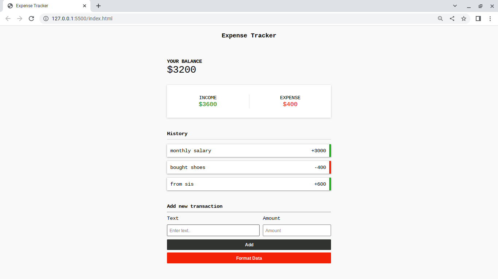

# 💰 Expense Tracker

A simple and lightweight Expense Tracker built with **HTML, CSS, and Vanilla JavaScript**. The application allows users to record income and expenses, automatically calculates the current balance, and stores transaction history using the browser's Local Storage.

## 📸 Preview

### Screenshot



### Demo

> **Demo Video:** `expenseTracker.webm`

GitHub doesn't play local `.webm` files directly from a README. You can download and view it from the repository, or upload it to a GitHub Release or Issue to embed a playable video.

---

## ✨ Features

- ➕ Add income transactions
- ➖ Add expense transactions
- 💵 Automatically calculate:
  - Total Balance
  - Total Income
  - Total Expense
- 📜 Transaction history
- 💾 Persistent storage using Local Storage
- ⌨️ Keyboard shortcuts
  - Press **Enter** in the Text field to move to Amount
  - Press **Enter** in the Amount field to add a transaction
- 🗑️ Format/Clear all saved transaction data

---

## 🚀 Built With

- HTML5
- CSS3
- Vanilla JavaScript
- Browser Local Storage API

---

## 📂 Project Structure

```
Expense-Tracker/
│
├── index.html
├── style.css
├── script.js
├── expenseTracker.png
├── expenseTracker.webm
└── README.md
```

---

## ▶️ Getting Started

### 1. Clone the repository

```bash
git clone https://github.com/samuel-fikiru/Expense-Tracker.git
```

### 2. Open the project

Simply open `index.html` in your browser.

No installation or dependencies are required.

---

## 📖 How to Use

1. Enter a transaction description.
2. Enter the amount.
   - Positive numbers (`100`) are treated as **Income**.
   - Negative numbers (`-50`) are treated as **Expenses**.
3. Click **Add**.
4. The balance, income, expense totals, and history update automatically.
5. Click **Format Data** to clear all saved transactions.

---

## 💾 Data Storage

All transactions are stored in your browser using **Local Storage**, allowing your data to remain available after refreshing or reopening the page.

---

## ⚙️ Future Improvements

- Edit existing transactions
- Delete individual transactions
- Transaction categories
- Date and time for each transaction
- Monthly reports
- Search and filter transactions
- Export transactions as CSV or PDF
- Responsive mobile improvements
- Dark mode

---


## 📝 Known Limitations

- Transactions cannot currently be edited or deleted individually.
- All data is stored locally in the browser only.
- Clearing browser storage removes all saved transactions.
- No backend or cloud synchronization.

---

## 📄 License

This project is open source and available under the **MIT License**.

---

## 👨‍💻 Author

Created as a JavaScript practice project to demonstrate:

- DOM Manipulation
- Event Handling
- Local Storage
- Dynamic UI Rendering
- Basic State Management

If you found this project helpful, consider giving it a ⭐ on GitHub!
